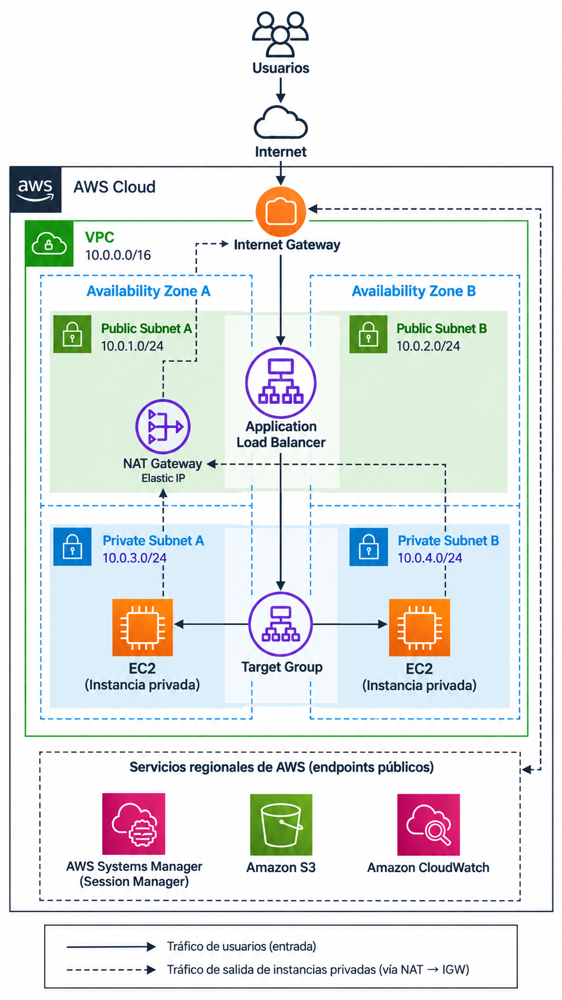
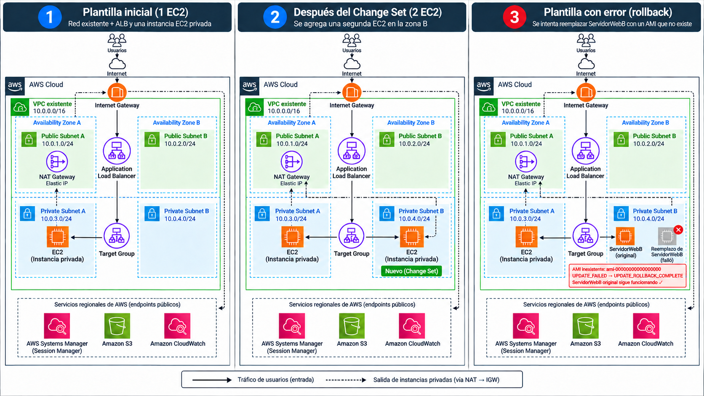

# 03 - AWS CloudFormation desde cero

En este módulo usamos **AWS CloudFormation** para desplegar, con una sola plantilla YAML, un **Application Load Balancer** público restringido a tu IP y servidores **EC2 privados** administrados con **Session Manager** (sin IP pública y sin abrir el puerto 22).

Después actualizamos la infraestructura con un **Change Set**, provocamos un **error intencional** para observar el **rollback automático** y eliminamos todo al final.

🎥 Video completo en el canal **My IT Mentors**: https://www.youtube.com/@myitmentors

---

## Arquitectura



> La VPC, las subnets, el Internet Gateway y el NAT Gateway **ya existen**. La plantilla crea el Application Load Balancer, el Target Group, los Security Groups, el rol IAM y las instancias EC2.

### Los 3 pasos del laboratorio



### Flujo

```
Tu computadora (IP /32)
        │ HTTP :80
        ▼
Application Load Balancer  (2 subnets públicas, internet-facing)
        │
        ▼
Target Group  (health check HTTP /)
        │
        ├──► EC2 ServidorWebA  (subnet privada A)
        └──► EC2 ServidorWebB  (subnet privada B, se agrega con el Change Set)

Administración de las EC2: AWS Systems Manager Session Manager (sin SSH)
```

> La **VPC y las subnets NO se crean** en este laboratorio: la plantilla reutiliza una VPC que ya existe y la recibe como parámetro.

---

## Requisitos

- Una **VPC existente** con:
  - **2 subnets públicas** en zonas de disponibilidad distintas (para el ALB).
  - **2 subnets privadas** en zonas de disponibilidad distintas (para las EC2).
  - **Salida a Internet desde las subnets privadas** (por ejemplo, un NAT Gateway), necesaria para que el agente de Systems Manager se registre y funcione Session Manager.
- Permisos para crear stacks de CloudFormation, EC2, Elastic Load Balancing e IAM (la plantilla crea un IAM Role).
- Tu **IPv4 pública** en formato `/32`. Puedes consultarla en https://checkip.amazonaws.com y agregarle `/32` al final (ejemplo: `203.0.113.10/32`).

---

## ⚠️ Costos

Este laboratorio **puede generar cargos**:

- El **Application Load Balancer** cobra por hora mientras exista.
- Las **instancias EC2** cobran mientras estén encendidas (según tu cuenta, `t3.micro` o `t2.micro` pueden estar dentro de la capa gratuita).
- Si tu VPC tiene un **NAT Gateway**, también cobra por hora (aunque no lo cree esta plantilla).

Al terminar, **elimina el stack** y verifica que no queden recursos activos.

---

## Archivos

| Archivo | Para qué se usa |
|---|---|
| `templates/01-plantilla-inicial-1a.yaml` | Despliegue inicial: ALB + 1 EC2 privada |
| `templates/02-plantilla-segunda-ec2.yaml` | Change Set: agrega `ServidorWebB` y muestra un **Replacement** |
| `templates/03-plantilla-error-rollback.yaml` | Error intencional: AMI inexistente en `ServidorWebB` → rollback |

---

## Parámetros de la plantilla

| Parámetro | Qué ingresar |
|---|---|
| `NombreProyecto` | Nombre corto para los recursos (por defecto `myit-cfn`) |
| `Ambiente` | `dev` o `prod` |
| `VpcId` | La VPC existente |
| `SubnetPublicaA` / `SubnetPublicaB` | Las 2 subnets públicas (zonas distintas) |
| `SubnetPrivadaA` / `SubnetPrivadaB` | Las 2 subnets privadas (zonas distintas) |
| `IpPermitida` | Tu IPv4 pública terminada en `/32` |
| `TipoInstancia` | `t3.micro` o `t2.micro` |
| `LatestAmiId` | Déjalo por defecto (Amazon Linux 2023 desde Systems Manager Parameter Store) |

## Recursos que crea

`SecurityGroupALB` · `SecurityGroupServidor` · `RolServidorSSM` · `PerfilServidorSSM` · `ServidorWebA` (y `ServidorWebB` desde la plantilla 02) · `GrupoDestinos` · `Balanceador` · `ListenerHTTP`

**Outputs:** `UrlAplicacion`, `DNSBalanceador`, `InstanciaAId` (e `InstanciaBId`), `SecurityGroupALBId`, `SecurityGroupServidorId`.

---

## Pasos

### 1) Crear el stack

1. **CloudFormation → Stacks → Create stack → With new resources (standard)**.
2. **Choose an existing template → Upload a template file** → sube `01-plantilla-inicial-1a.yaml`.
3. Escribe un **Stack name** y completa los **Parameters**.
4. En **Configure stack options**, las opciones usadas en el video:
   - **Express mode:** desactivado.
   - **Behavior on provisioning failure:** `Roll back all resources`.
   - **Delete newly created resources during a rollback:** `Use deletion policy`.
   - **Disable deployment validations:** sin marcar.
   - **Termination protection:** desactivada.
5. Marca el **acknowledgement de IAM** (la plantilla crea un IAM Role) → **Submit**.
6. Revisa la pestaña **Events** hasta ver `CREATE_COMPLETE`.

### 2) Probar

1. Pestaña **Outputs** → abre `UrlAplicacion` en el navegador.
2. **EC2 → Target Groups → Targets**: la instancia debe aparecer **Healthy**.
3. **EC2 → Instances →** selecciona la instancia **→ Connect → Session Manager**.
   Si todavía no aparece disponible, espera uno o dos minutos: el agente necesita registrarse.

### 3) Change Set: agregar una segunda EC2

1. En el stack, crea un **Change Set** reemplazando la plantilla actual por `02-plantilla-segunda-ec2.yaml` (mantén los mismos parámetros).
2. Revisa las acciones antes de ejecutar:
   - `ServidorWebB` → **Add**.
   - `SecurityGroupALB` → **Modify** con **Replacement: True** (en la plantilla se cambió a propósito su `GroupDescription`, una propiedad que obliga a reemplazar el recurso).
   - Otros recursos dependientes → **Modify** con **Replacement: False**.
3. **Execute change set** y comprueba que ambas instancias queden registradas en el Target Group.

### 4) Error intencional y rollback

> Aplica este paso **después** del paso 3.

1. Crea otro Change Set con `03-plantilla-error-rollback.yaml`. Esta plantilla le coloca a `ServidorWebB` la AMI inexistente `ami-00000000000000000`.
2. Ejecútalo y observa **Events**:
   - `ServidorWebB` → `UPDATE_FAILED` (en **Status reason** verás que el ID de la AMI no es válido).
   - El stack pasa a `UPDATE_ROLLBACK_IN_PROGRESS` y termina en `UPDATE_ROLLBACK_COMPLETE`.
3. Vuelve a abrir `UrlAplicacion`: la aplicación sigue funcionando porque CloudFormation regresó al último estado estable.

### 5) Limpieza

1. **Stack actions → Delete stack**.
2. Espera a que el stack desaparezca por completo y verifica en EC2 que no queden el Load Balancer, el Target Group ni las instancias.

---

## Documentación oficial

- AWS CloudFormation: https://docs.aws.amazon.com/AWSCloudFormation/latest/UserGuide/Welcome.html
- Referencia de tipos de recursos: https://docs.aws.amazon.com/AWSCloudFormation/latest/TemplateReference/aws-template-resource-type-ref.html
- Recursos de Amazon EC2 en CloudFormation: https://docs.aws.amazon.com/AWSCloudFormation/latest/TemplateReference/AWS_EC2.html
- AWS::EC2::SecurityGroup: https://docs.aws.amazon.com/AWSCloudFormation/latest/TemplateReference/aws-resource-ec2-securitygroup.html
- Change Sets: https://docs.aws.amazon.com/AWSCloudFormation/latest/UserGuide/using-cfn-updating-stacks-changesets.html
- Drift: https://docs.aws.amazon.com/AWSCloudFormation/latest/UserGuide/using-cfn-stack-drift.html
- Session Manager: https://docs.aws.amazon.com/systems-manager/latest/userguide/session-manager.html
